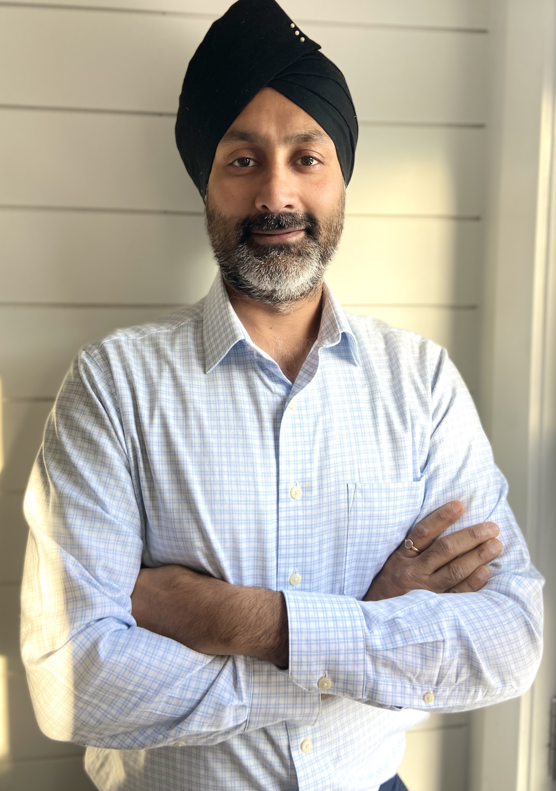

## Timeline

###### Dec 2023 - Present
I'm a Principle Scientist at [Multiverse Computing](https://multiversecomputing.com/), where I lead a research team to develop tensor network algorithms for [simulating quantum many-body systems on classical computers](https://journals.aps.org/prresearch/abstract/10.1103/PhysRevResearch.6.013326), [compressing large neural networks](https://arxiv.org/abs/2401.14109), combinatorial optimization, and quantum chemistry.

###### Jun 2021 - Nov 2023
I was a Senior Research Fellow in the Quantum Information Group led by [Kavan Modi](https://research.monash.edu/en/persons/kavan-modi) at Monash University in Melbourne, Australia. I helped developed a [new theory](https://arxiv.org/abs/2312.04624) of non-Markovian quantum processes with long-range memory, characterized by long-range temporal correlations that decay polynomially. I proposed that a large class of such processes can be represented by tree tensor networks made of causality preserving tensors, which are mathematically described by linear maps between [process tensors](https://arxiv.org/abs/1512.00589), providing a first example of an explicit ansatz for such processes.

###### Jan 2021 - Jun 2021
Had lots of fun and sleepless nights with my twin boys (born in Jan 2021).

###### July 2018 - Dec 2020
I was a Senior Research Fellow in the Quantum Information, Gravity, and Fields group led by [Michal Heller](https://scholar.google.com/citations?user=_zIEMx4AAAAJ&hl=en), where I worked on incorporating conformal symmetry in tensor networks for studying conformal field theories. This work is still incomplete and the completed parts are unpublished. I've discussed some of the ideas with [Guifre Vidal](https://heritageproject.caltech.edu/interviews/guifre-vidal), [Ingo Runkel](https://www.qu.uni-hamburg.de/cluster/team/runkel.html), [Michal Heller](https://scholar.google.com/citations?user=_zIEMx4AAAAJ&hl=en), and [Dominic Williamson](https://sites.google.com/site/dominicjw/home) and presented them ideas at a couple of workshops -- Mathematics of Conformal Field Theory at the Australian National University in Canberra, Australia (2021), Meeting on string nets and tensor networks in Hamburg, Germany (2020), and the Workshop on Quantum Simulation: Gauge Fields, Holography, and Topology in Bilbao, Spain (2019). 

During this time, I also co-organized and hosted the online [HEP-TN seminars](https://www.youtube.com/playlist?list=PLaib4I4mFNmWKntxAZcB-EQJ_B-PkWEEL). This was before Covid! We were so excited about kickstarting an organized online seminar series that we even posted a [note](https://arxiv.org/pdf/2004.09922) on arXiv trying to convince people that this was a good alternative (or at least a healthy mix) to in-person research visits. 

###### Sep 2018
My beautiful daughter is born, providing my first insight into how humans can, in fact, go for months without much food, sleep, entertainment, etc.

###### Jul 2016 - Jun 2018
I was a Research Fellow in the Quantum Foundations group the Institute of Quantum Optics and Quantum Information, located in the classical city of Vienna, led by [Miguel Navascues](https://www.iqoqi-vienna.at/research/navascues-group). Here, I helped developed a new numerical method for [detecting Bell’s inequalities using tensor networks](https://journals.aps.org/prl/abstract/10.1103/PhysRevLett.118.230401) and [renormalization group techniques](https://journals.aps.org/prx/abstract/10.1103/PhysRevX.10.021064) 

###### Sep 2011 - Jun 2016
I was a Research Fellow in the Topological Quantum Computing group at Macquarie University, led by [Gavin Brennen](https://vimeo.com/330707461). 
- I helped generalize the [Time-Evolving Block Decimation algorithm](https://en.wikipedia.org/wiki/Time-evolving_block_decimation) for the classical many-body simulation of [anyons](https://phys.org/news/2024-02-phase-physicists-abelian-anyons-quantum.html). 
- I helped develop a new method for [simulating quantum field theory using wavelets](https://journals.aps.org/pra/abstract/10.1103/PhysRevA.92.032315).
- I [proposed](https://arxiv.org/abs/1409.7873) a new [Matrix Product State](https://tensornetwork.readthedocs.io/en/latest/basic_mps.html)-based algorithm to detect one-dimensional [symmetry protected topological phases of matter](http://topo-houches.pks.mpg.de/wp-content/uploads/2015/01/pollmann_spt.pdf) without using order parameters (local or non-local). I'm actually proud about this work! Regrettably, I never advertised or presented this work (due to unfortunate personal circumstances at the time), so this work went pretty much under the radar. I'm currently exploring a generalization of this method, see list of ongoing projects below.
- I proposed that a [Multi-scale Entanglement Renormalization Ansatz](https://www.benasque.org/2015gravity/talks_contr/211_VidalBenasque2015.pdf) (MERA) tensor network representation of a quantum state with a global symmetry necessarily gauges the symmetry in the bulk of the MERA. This idea was first presented [here](https://journals.aps.org/prb/abstract/10.1103/PhysRevB.88.121108), and later explored in these following papers.
- I also dabbled with a few other ideas ([1](https://journals.aps.org/prd/abstract/10.1103/PhysRevD.97.026012), [2](https://journals.aps.org/prd/abstract/10.1103/PhysRevD.97.026013), [3](https://www.nature.com/articles/s41534-020-0255-7)) about [holographic tensor networks](https://www.preposterousuniverse.com/blog/2015/05/05/does-spacetime-emerge-from-quantum-information/).

###### 2007 - 2011
I was fortunate enough to be a PhD student in Guifre Vidal's group at the University of Queensland, where I began my love affair with Tensor Networks. For my PhD thesis, I  studied the problem of how to incorporate global internal symmetries (Abelian and non-Abelian) into tensor networks. 
- My [first-ever paper](https://iopscience.iop.org/article/10.1088/1367-2630/12/3/033029/meta), was the first-ever to describe how to incorporate SU(2) symmetry in the [Time-Evolving Block Decimation algorithm](https://en.wikipedia.org/wiki/Time-evolving_block_decimation) algorithm. Coincidentally, we posted this paper at the same time as [Ian McCullouch](https://mptoolkit.qusim.net/Profiles/Profiles) posted his paper on incorporating SU(2) symmetry into the [Density Matrix Renormalization Group algorithm](https://www.nature.com/articles/s42254-023-00572-5), which, like TEBD, is also an Matrix Product State-based algorithm.
- In [this](https://journals.aps.org/pra/abstract/10.1103/PhysRevA.82.050301) paper, we described a theory of how to incoporate symmetries in generic tensor networks.
- In [this](https://journals.aps.org/prb/abstract/10.1103/PhysRevB.83.115125) paper, we descibed how to implement the concrete case of U(1) symmetry. We demonstrated the first implementation of U(1)-symmetric MERA.
- In [this](https://journals.aps.org/prb/abstract/10.1103/PhysRevB.86.195114) paper, we described how to implement the concrete case of SU(2) symmetry. We demonstrated the first implementation of SU(2)-symmetric MERA.  

## Ongoing personal projects
#### Physics
- Incorporating conformal symmetry in discrete tensor networks
- Matrix Product States with built-in categorical symmetries

#### Deep learning
- Mechanistic Interpretability via Tensorized Neural Networks (TNNs): How do activations circuits develop inside TNNs? Do TTNs generalize better than dense NNs?

## Slides from some of my talks
- [Introduction to MERA](https://github.com/qsukhi/qsukhi.github.io/blob/main/assets/slides/Intro_to_MERA_ETN_School.pdf?raw=true) [Delivered at the European Tensor Network School]
- [Introduction to Symmetric Tensor Networks](https://github.com/qsukhi/qsukhi.github.io/blob/main/assets/slides/Intro_to_Syms_ETN_School.pdf?raw=true) [Delivered at the European Tensor Network School]

- [Tensor networks and quantum phases of matter](https://github.com/qsukhi/qsukhi.github.io/blob/main/assets/slides/TNs_quantum_phases.pdf?raw=true) [Delivered at Technical University of Munich]

- My [rant](https://github.com/qsukhi/qsukhi.github.io/blob/main/assets/slides/intro_to_ncon.pdf?raw=true) on why you should use ncon() for implementing tensor network contractions. [Delivered to non-TN experts at Monash University)
- [Using MPS to detect violations of Bell inequalities](https://github.com/qsukhi/qsukhi.github.io/blob/main/assets/slides/nonlocality.pdf?raw=true)
  
- An early [idea](https://github.com/qsukhi/qsukhi.github.io/blob/main/assets/slides/Early_idea_MERA_Coogee.pdf?raw=true) on how to build a holographic description of the MERA. [Delivered at Coogee Quantum Information Workshop in Sydney]
- [Overview](https://github.com/qsukhi/qsukhi.github.io/blob/main/assets/slides/MERA_and_holography.pdf?raw=true) of the connection between the MERA and holography [Delivered at Technical University of Vienna]
- A [talk](https://pirsa.org/16100044) I gave at Perimeter Institute
